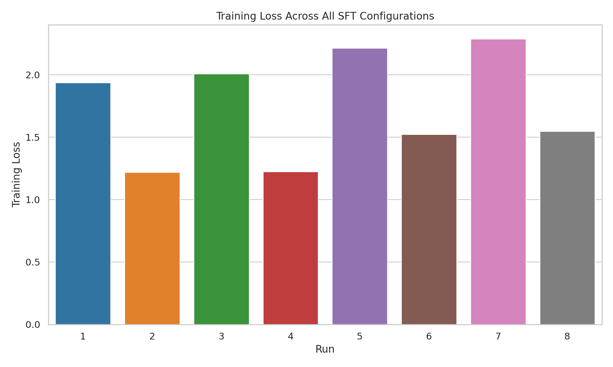
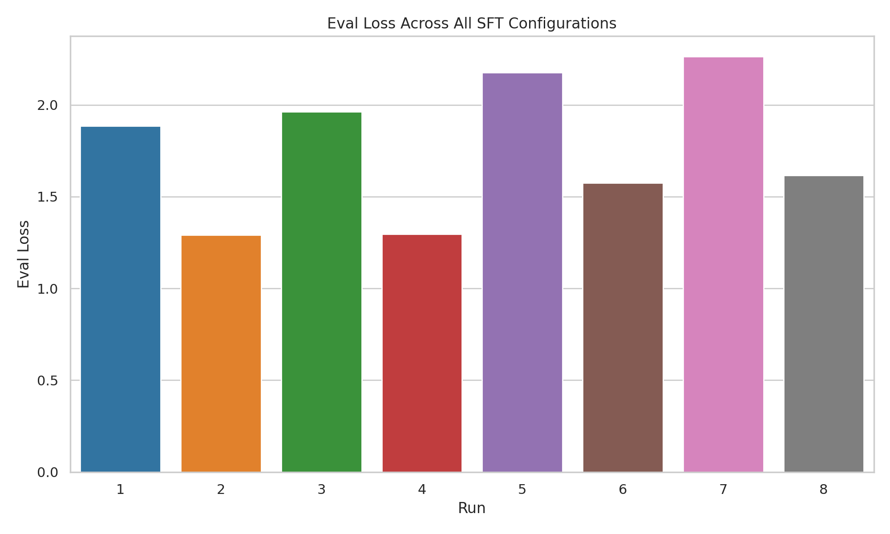

# ⚠️ Please read before proceeding.

This notebook runs multiple SFT configurations sequentially on free-tier Google Colab.
Because of this, TensorBoard metrics appear gradually over time. This is normal and expected, not a logging issue.
What reviewers should expect:

*   Each SFT run writes TensorBoard event files only after training begins  
      
    
*   Early runs appear first in TensorBoard  
      
    
*   Later runs appear only after their training starts  
      
*   # **It is normal to**:  

    *   **wait 5-10 minutes after launching TensorBoard**
    *   **refresh TensorBoard (You SHOULD see the refresh button within the tensorboard portal itself)**
    *   initially see metrics for only some runs
    *   see sparse curves early in a run

*   The final metrics table is extracted directly from TensorBoard event files and represents the authoritative comparison across all runs     
    
* * *


# RapidFire AI Winter Competition — SFT Track  
## Supervised Fine-Tuning Experimentation for an E-Commerce Customer Support Chatbot

## Links
- **Notebook:** https://colab.research.google.com/drive/1Y3m8alKSOX5cXXdyt7AA_qnu5eq63rQZ?usp=sharing
- **Repo:**  
  https://github.com/lsasubilli/rapidfire-sft-experiment/blob/main/SFT_Submission_Lalith_.ipynb
- **Screenshots:** https://drive.google.com/drive/folders/1IoBa0QDRukhm6oo0PtT8fdblAKj49n_V?usp=sharing

## Overview
This repository contains a reproducible, multi-configuration **Supervised Fine-Tuning (SFT)** experiment built for the **RapidFire AI Winter Competition on LLM Experimentation (Dec 22, 2025 – Jan 19, 2026)**. The goal of this submission is not to chase a leaderboard score, but to demonstrate a clear and customer-ready experimentation workflow: define a realistic use case, vary meaningful configuration “knobs,” log metrics reliably, and produce artifacts that make comparison across runs easy.

This project fine-tunes small open models on a public e-commerce customer support dataset and compares how changes in:
- Base model (architecture/size)
- Prompt formatting scheme
- LoRA configuration (PEFT)

affect convergence and simple text-quality metrics.

All runs log to TensorBoard, and the notebook includes a post-training cell that extracts final scalars from TensorBoard event files into a clean results table (and optional CSV) suitable for reports and one-page summaries.

## Competition Fit (What this submission is designed to prove)
**Program Purpose:** RapidFire AI’s competition emphasizes reusable experimentation artifacts: notebooks that a real team could fork and run to learn and iterate, not “one-off” scripts.

This submission is aligned with that purpose:
- Runs end-to-end on free Google Colab (T4)
- Uses public models and public data
- Avoids paid/closed APIs
- Uses RapidFire AI’s experimentation API to run multi-config SFT
- Varies at least two required knob types (in practice, three):
  - base model architecture
  - prompt scheme / formatting function
  - LoRA configuration
- Produces TensorBoard artifacts that show curves across all configs
- Produces a final metrics table extracted from TensorBoard, enabling quick comparison across runs
- Includes a “safe TensorBoard launch” cell to avoid empty dashboards on fresh runtimes

## Use Case
E-commerce customer support is a common first fine-tuning workload: questions are structured (refunds, shipping, cancellations, account issues), answers need to be concise and policy-consistent, and evaluation can start with simple metrics before moving to human review.

This notebook fine-tunes small causal LMs so they better follow a chosen instruction format and produce support-style responses.

## Dataset
**Dataset:** `bitext/Bitext-retail-ecommerce-llm-chatbot-training-dataset`

This dataset provides instruction/response pairs that resemble real retail support interactions (order status, shipping delays, refunds, returns, cancellations). It is lightweight enough to run quickly on free Colab while still reflecting a realistic support domain.

### Splits used (lightweight by design)
To keep runtime predictable and to ensure all runs complete under Colab constraints:
- **Train:** 96 examples (shuffled with a fixed seed)
- **Eval:** 16 examples (shuffled with the same seed)

This size is intentionally small for experimentation clarity. The point is to show reliable multi-run comparison and artifact generation, not to maximize final model quality.

## What “good” looks like (Success definition)
After training, a “good” run should:
1. Converge stably (training loss decreases without instability)
2. Show better eval loss than weaker configs on the same eval slice
3. Produce responses that align with the prompt style (Q/A or instruction template)
4. Improve simple overlap-based metrics (ROUGE-L, BLEU) on the eval set

The notebook measures (2) and (4) directly. The prompt formatting control makes (3) easy to spot-check.

## Setup
- **Base model(s):** gpt2, distilgpt2
- **Dataset/domain:** Bitext Retail E-Commerce customer support
- **Train/Eval split:** train=96, eval=16 (sampled from train split for lightweight iteration)
- **Training method:** SFT with LoRA (PEFT), comparing LoRA ranks + target modules
- **Compute:** free Google Colab GPU (T4), runs sequentially for stability

## Experiment Design
This submission is a small but complete example of how to structure fine-tuning experimentation.

### Knob 1: Base model
- gpt2
- distilgpt2

**Reason:** these models are small, fast, and realistic for “starter” SFT experiments in constrained environments.

### Knob 2: Prompt scheme / formatting function
Two prompt styles are compared:

**Q/A style**
```text
Question: <instruction>
Answer: <response>
```

### Instruction:
<instruction>
### Response:
<response>

Reason: rank and target modules control adaptation capacity. A larger rank and broader module coverage can help expressiveness but may be less stable or more prone to overfitting on tiny data.

### Total run count

The notebook defines 4 base configs (2 models × 2 prompt schemes) and applies a LoRA grid with 2 options. This expands into 8 runs total.

* * *

## Reproducibility and Stability Choices

This notebook is written to run reliably on free Colab, including on fresh accounts/runtimes.

Key decisions:

*   Fixed random seed for Python, NumPy, and Torch  
      
    
*   Disabled tokenizer parallelism to avoid noisy runtime behavior  
      
    
*   Logging configured to always produce multiple points:  
      
    

*   max\_steps=60  
      
    
*   logging\_steps=1  
      
    
*   eval\_steps=5  
      

*   Runs executed sequentially (num\_chunks=1) to reduce “missing run logs” under constrained resources  
      
    
*   Unique run\_name per config to avoid TensorBoard collisions  
      
    
*   TensorBoard launch is delayed until event files exist (prevents empty dashboards)  
       

* * *

---

## Screenshots (what each image proves)

### 1) TensorBoard — Train Loss across all 8 runs


**What this shows**
- All runs **learn** (loss decreases), but at different rates and final values.
- **Run 2 and Run 4** converge to the **lowest training loss**, indicating stronger fit under identical step budgets.
- Higher-final-loss runs (e.g., Runs 5/7) likely reflect weaker config choices for this tiny slice.

---

### 2) TensorBoard — Mean Token Accuracy across all 8 runs


**What this shows**
- Mean token accuracy **rises steadily** for most runs → stable training signal (no collapse).
- The ranking aligns with eval outcomes: **Run 2/4 are top**, Runs 5/7 are bottom.
- This metric is useful as a fast, deterministic “training health” indicator when you’re avoiding LLM judges.

---

### 3) Results Table — Final metrics extracted from TensorBoard event files (authoritative)


**What this shows**
- This table is extracted programmatically from event files → **no manual TensorBoard inspection required**.
- It enables clean reporting + CSV export for comparisons.

---

### 4) Progress / “why do I only see some runs?” (Sequential logging is expected on free Colab)


**What this shows**
- Runs appear **gradually** because configs execute **sequentially** on free-tier Colab.
- Early on, TensorBoard may show only Runs 1–3; after more training completes and you refresh, you’ll see all 8.
- The extracted metrics table (above) is the **final source of truth** once all runs finish.

---

### 5) Final comparison plots (optional, quick-glance)



**What this shows**
- A compact “scoreboard” view of **final training vs eval loss** per run.
- Helps reviewers see the winner without scrolling TensorBoard.

---

## Metrics and Artifacts

### Metrics logged to TensorBoard

*   Training loss  
      
    
*   Eval loss  
      
    
*   ROUGE-L  
      
    
*   BLEU  
      
    
*   Additional trainer/system scalars (runtime, learning rate, grad norm, token accuracy where available)  
      
    

### Why these metrics

This competition track rewards experimentation clarity. Loss and eval loss provide an optimization signal; ROUGE-L and BLEU provide a simple, deterministic text overlap signal that is easy to reproduce without paid judges.

### Artifacts this repo is intended to include

*   TensorBoard event files (generated under the RapidFire experiment directory)  
      
    
*   Plots visible immediately upon opening TensorBoard  
      
    
*   A tabular “final metrics per run” summary extracted programmatically from event files  
      
    
*   Logs (e.g., rapidfire.log, training logs) exported from the Colab runtime into the repo  
       

* * *

## How to Run (Colab)

1.  Open the notebook in Google Colab (GPU enabled).  
      
    
2.  Run cells top-to-bottom.  
      
    
3.  After training finishes, the notebook launches TensorBoard safely (only after event files exist).  
      
    
4.  Run the metrics extraction cell to produce the final results table (and optional CSV).  
      
    

Notes:

*   Hugging Face token is not required for public models/datasets, but Colab may show a warning if HF\_TOKEN is not set.  
      
    
*   The notebook uses a small dataset slice so that all configs complete within free-tier limits.  


## Fine-Tuning Experiment Summary

### What I tried

This project fine-tunes small causal language models to answer e-commerce customer support questions more consistently and in a chosen instruction format. “Good” means stable convergence and improved eval metrics on a held-out set: lower eval loss and better ROUGE-L/BLEU, while producing answers that stay on the prompt format. We compare multiple configurations to show how model choice, prompt scheme, and LoRA settings influence these outcomes.

### Setup 

*   Base model(s): gpt2, distilgpt2  
      
    
*   Dataset(s) / domain: bitext/Bitext-retail-ecommerce-llm-chatbot-training-dataset (retail customer support)  
      
    
*   Train/Eval split: train=96, eval=16 (sampled for fast iteration; shuffled with fixed seed)  
      
    
*   Training method: SFT + LoRA (PEFT)  
      
    
*   Compute: Colab T4 GPU; sequential multi-run execution for stability  
      
    

### Experiments (what changed)

*   Baseline: smaller LoRA (r=8) with narrow target module coverage (c\_attn)  
      
    
*   Config A: larger LoRA (r=32) and expanded targets (c\_attn, c\_proj)  
      
    
*   Config B: prompt scheme change (Q/A vs Instruction template)  
      
    
*   Config C: base model change (gpt2 vs distilgpt2)  
      
    

In practice, these combine into an 8-run grid so results reflect interactions between knobs.

### Results
Fill this table after you run the notebook and extract final metrics (the notebook generates a results DataFrame / CSV you can copy from).

| Config | Key change(s) | Main metric | Notes |
| --- | --- | --- | --- |
| Baseline | distilgpt2 + Q/A + LoRA r=8 (c_attn) | eval_loss | fast, stable baseline |
| A | same but LoRA r=32 (c_attn, c_proj) | eval_loss / ROUGE-L | tests higher capacity |
| B | prompt: Instruction template | ROUGE-L / BLEU | tests format conditioning |
| Best | fill from your extracted table | eval_loss (and ROUGE-L/BLEU) | include tradeoff note |

### Takeaways

*   What helped most: typically one of (prompt format consistency) or (larger LoRA capacity) improves overlap metrics and/or eval loss, but the “best” depends on the tiny eval slice and stability.  
      
    
*   What didn’t help / surprising: larger LoRA does not always win on small data; it can overfit or show noisier metrics.  
      
    
*   Failure modes: on tiny eval sets, ROUGE-L/BLEU can be unstable; results should be interpreted as directional. This is why the notebook emphasizes reproducibility and artifact generation rather than claiming production-ready performance.  
      

* * *

## How RapidFire AI helped (explicitly addressing the track goals)

RapidFire AI is used here as the orchestration layer that turns fine-tuning into an experiment, not a one-off run:

*   Multi-config execution with a clear config grid (base model × prompt scheme × LoRA variants)  
      
    
*   Experiment tracking under a named experiment directory, which keeps runs organized  
      
    
*   TensorBoard logging integration so curves are available across all runs  
      
    
*   Interactive controls (Stop / Clone-Modify workflows) to support iteration during experimentation  
      
    
*   A clean structure that a customer can reuse as a starter template for their own SFT experiments  


## Notes for reviewers / reusers

*   This notebook intentionally uses a small dataset slice so that multi-config experimentation is fast and reproducible on free Colab.  
      
    
*   The results extraction step is designed to remove manual TensorBoard inspection for final reporting: you get a clean table of “final logged scalars per run.”  
      
    
*   If you want more stable ROUGE/BLEU, increase eval size and train steps, but keep the grid small enough to remain runnable on free-tier hardware.  
      
    

* * *

